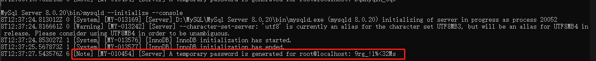
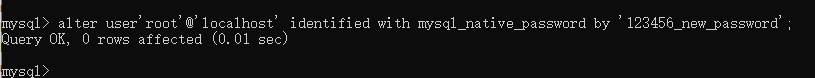

### 1、首先先去官网将自己需要的版本下载到本地

由于我的电脑已经安装了mysql5.5与mysql5.7，为方便演示，使用mysql8.0.20进行安装。

```http
https://dev.mysql.com/downloads/mysql/
```

### 2、解压路径

我将mysql 8.0.20解压至目录`D:\MySQL\MySql Server 8.0.20\`。同时从mysql5.5那边复制了一份my.ini。


### 3、配置环境变量

我这里直接添加mysql8.0.20的bin目录到Path中：

### 4、配置my.ini

```ini
[client]
port=3308

[mysqld]
# The TCP/IP Port the MySQL Server will listen on
port=3308

#Path to installation directory. All paths are usually resolved relative to this.
basedir="D:/MySQL/MySql Server 8.0.20/"

#Path to the database root
datadir="D:/MySQL/MySql Server 8.0.20/Data/"
```

### 5、安装服务mysql8.0（第一步）

- 以管理员权限运行cmd，然后进入目录`D:\MySQL\MySql Server 8.0.20\bin\`

- 安装mysql8.0服务：

  ```order
  mysqld --install mysql8.0
  ```

  若安装成功，则提示Service successfully installed：

  

### 6、初始化服务

由于在my.ini配置了以下路径：


因此，执行以下指令对其进行初始化：

```order
mysqld --initialize --console
```

我记得我在mysql5.7执行这条指令时遇到了两个问题：

​	①报错unknown variable 'table-cache=256' 。解决方案是将my.ini的table_cache修改为table_open_cache。

​	②报错unknown variable 'innodb_additional_mem_pool_size=2M'。解决方案是添加路径配置tmpdir="D:/MySQL/MySQL Server 8.0/Data/"（路径随意，我这里选择与sql8.0 server同路径），同时注释掉innodb_additional_mem_pool_size=2M这个配置。


**注意**：每次报错修改完my.ini文件后，需要删掉Data文件，否则会产生两次初始化之间的冲突。

然后现在是在mysql8.0中执行这条指令，却遇到了其他问题：

​	①报错 Error while setting value 'STRICT_TRANS_TABLES,NO_AUTO_CREATE_USER,NO_ENGINE_SUBSTITUTION' to 'sql_mode'。解决方案是注释条mysql.ini的这行配置。理由貌似是mysql5.x是不允许BLOB/TEXT类型的字段拥有默认值，而在mysql8.0中将其该为NOT STRICT模式，则该指令是可以执行的。

​	②报错unknown variable 'query_cache_size=0'，同样注释掉该配置。

​	③报错unknown variable 'innodb_additional_mem_pool_size=2M'，之后我按照之前按照mysql5.7的经验，将innodb_additional_mem_pool_size=2M这个配置注释掉，然后添加路径配置tmpdir="D:/MySQL/MySQL Server 8.0/Data/"。然而一直报错Unable to create temporary file; errno: 2。试了好久，发现只要不加tmpdir这个配置就可以了。


经历了上面的几个报错之后，终于初始化成功了。warning啥的暂时不管它。成功后，mysql会自动给你一个临时的密码，记得保存一下，待会修改密码要用。


### 7、安装服务mysql8.0（第二步）

之后进入服务窗口进行查看是不是多了个mysql8.0服务：


点击鼠标右键，查看该服务的属性，查看路径：


由于路径不是mysql8.0的路径，因此进入注册表手动更改它。

打开注册表`HKEY_LOCAL_MACHINE\SYSTEM\CurrentControlSet\Services\`然后找到服务mysql8.0，点击鼠标右键，对ImagePath进行修改，修改为我们mysql8.0的路径：


### 8、启动mysql8.0服务，并修改密码

- 启动mysql8.0服务

  ```order
  net start mysql8.0
  ```

  

- 进入mysql8.0

  ```order
  //注意端口号与my.ini中的端口号一致
  mysql -uroot -P3308 -p 
  
  //然后输入密码
  //这个密码是前面保存的临时密码
  Enter password:9rg_!l%<32Ms	
  ```

  ok，成功进入

  

  

- 修改密码

  ```sql
  set password for root@localhost=password('123456_new_password');
  ```

  平时用mysql5.x的时候用这个指令修改密码还是可以的，但到了mysql8.0，一致报错 You have an error in your SQL syntax; check the manual that corresponds to your MySQL server version for the right syntax to use near 'password('123456_new_password')' at line 1。看这个报错，一边估计着一边摸摸自己凉飕飕的脑袋，猜想应该是语法错误，大概率是mysql8.0不支持这个语法进行修改密码了。

  

  然后试了一下，发现用以下两个常用的修改密码的命令也不行：

  ```order
  //①
  mysqladmin -uroot -p 9rg_!l%<32Ms password 123456_new_password
  
  //②
  update user set password=password('123456_new_password') where user='root' and host='localhost'; 
  ```

  最后搞来搞去弄了半天，发现这个可以改：

  ```sql
  alter user'root'@'localhost' identified with mysql_native_password by '123456_new_password';
  ```

  

  exit后试着用新密码重新进入mysql8.0，成功进入！

