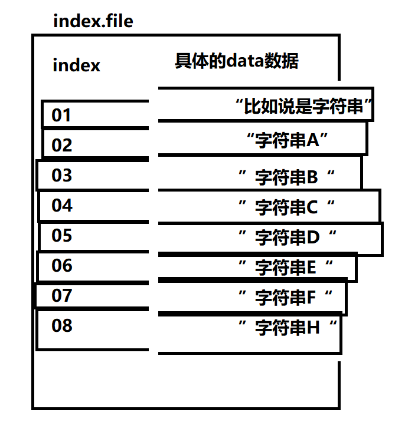

# 1、什么是索引

##### （1）事前说明：

- 索引是**按一定顺序**储存数据的**数据结构**。

许多文章都拿查字典的例子来比喻并引进索引的概念，作者认为这个例子很好很经典，但也有所欠缺的地方，因此，本文会拿该例子作为开篇并对该例子进行适当补充解释。

##### （2）字典的结构：

当我们持有一本汉语词典，我们会把字典的结构分为两个部分，一是目录，二是内容部分。

为了方便，我们暂且将目录称为**D_part**，内容为**C_part**。（表示Directory part和Content part）

##### （3）拼音查找：

当我们要查“丨”（gǔn）字的时候，我们会去D_part查拼音为gun的汉字所在的页码。假如在D_part中不存在该字，那则表明你的字典中不存在“丨”字。相反，如果你通过拼音“gun”在D_part中找到了“丨”字，那你可以通过D_part中所标注的该字的页码，快速定位到“丨”字在C_part的具体位置。

这个过程我们通过英文字母a\~z的顺序，在目录中快速定位g所在的D_part位置，然后快速定位gun的C_part位置。无数的汉字中，不仅仅D_part是根据a\~z进行排序的，连C_part的内容也是根据a\~z进行排序的，这就是有序的拼音查找。

简单点总结： D_part和C_part都按一定的顺序（即a\~z的顺序）进行排列。

##### （3）偏旁查找：

当我们要查“该”字的时候，我们并不知道这个字的拼音。并且，我们无法像拼音查找那样通过a\~z的顺序进行查找，而只能将同类偏旁的汉字聚集成一个集合，并列出在D_part中。同时，同一个偏旁的两个字，在C_part中的位置，那有可能一个在“天涯”，一个在“海角”，即一个可能在第1页，另一个在999页。也有可能这两个字是紧挨着相邻的，都在第100页。

例如，同个偏旁的“恺”、“慨”和“情”，即读音为{kǎi、kǎi、qíng}。“恺”和“慨”不仅偏旁相同，而且读音也相同，那么这两个字，可能会同在第100页，而“情”字却可能在最后一页。

简单点总结：D_part按偏旁相同的汉字的集合来作为有顺序的目录索引，而C_part不是按偏旁排序，甚至可能随机分布。

##### （4）聚集索引和非聚集索引

*ok，理解上面抽象的概念，我们开始将上面的概念对应到实际物理硬盘文件中。*

假如我们先创建两个文件，index.file和data.file（分别对应上面例子的**D_part**和**C_part**）。

并将index.file中的所有内容按0\~9的顺序排序。

###### ①聚集索引

定义——**数据行的*物理顺序*与列值（一般是主键的那一列）的*逻辑顺序*相同，一个表中只能拥有一个聚集索引。**

类比拼音查找的方式，index.file和data.file都是按顺序排序的，并且按顺序一一对应，如图：


既然是一一对应，那么我们为何不可将两个文件合并为一个文件？即：



​		**这种将索引文件与具体数据文件直接放在一起的结构，我们称为聚集索引。因为通过index就可以直接得到具体的data。但前提是两者本身就是按一定的顺序储存的，我们才能直接合并，否则如果是乱序排列，按这种方式来索引查找，那只会使人更加凌乱。**

**需要注意的是，定义中说：一个表只能拥有一个聚集索引，为什么？因为这既然是按某种顺序进行排列的，那么这种顺序只能是唯一。比如按数字排列，0\~9,10\~99......这种顺序是唯一确定的，因此一个表只能是有一个聚集索引**

###### ②非聚集索引

定义——**该索引中索引的*逻辑顺序与磁盘上行的物理存储顺序不同*，一个表中可以拥有多个非聚集索引。**

根据定义，再类比按偏旁进行索引的方式，可以知道，字典D_part中的内容是有规则次序的不同偏旁的集合，但所指向的C_part的位置却可能是混乱的。按这种方式，映射到文件中，虽然index.file中的index是有顺序的，但我们的index.file与data.file之间的对应关系却会感觉比较混乱，即：


但是，我们却没办法像聚集索引那样，将index.file和data.file合并成一个文件。要论为什么，就必须结合我们数据库中的Table。

data.file里面的内容其实就是数据库中的一个Table，而这个Table具有index和data两个字段。假如这个Table中你的index字段是随机产生的主键，那么从头到尾看下来，这个字段肯定不会是有序的（因为概率太小了，所以几乎不可能有序）。

所以如果data.file要与index.file合并为同一个文件，那只能是要么index.file中的index字段乱序，要么data.file中的data字段乱序。如果data字段乱序，那么你的数据库中的表的次序也就直接改变了，因此不可以这么做。而如果如此index.file中的index字段乱序，拿就违背初衷了，因为索引其实就是用来快速查找数据用的。就像字典的目录混乱不堪，如此还怎么查汉字？

- **需要注意的是定义中说了，一个表可以拥有多个非聚集索引，为什么？对比聚集索引，由于聚集索引本身的index.file与data.file都是按顺序排列的，所以本身只能有一个聚集索引，而非聚集索引本身所指向的data.file的数据是乱序的，因此不受顺序规则的限制，可以有多个非聚集索引**

③面纱：

这个所谓的index.file和data.file，其实对应的是windows系统中mysql目录下的\*.myi和\*.myd文件，\*.myi保存的是表的索引，\*.myd保存的是表的数据记录。

**myi：MYisam Index**

**myd：MYisam Datas**

ibd：InnoDB datas

（作者电脑上的mysql目录位置是windows系统下的**D:\MySQL\data\mysql**）

- 其中，MySql中的**MyISAM引擎**便是采用这种索引文件与数据文件相分离的储存结构，其B+tree的叶子节点储存的是指向*.myd 文件中数据的指针，即MyISAM采用**非聚集索引**。
- 而**InnoDB引擎**采用的是便是**聚集索引**，它将数据库中的索引字段提前先排序好，然后再将索引与数据储存进同一个文件中，这个合并之后的文件便是*.ibd/ibdata1。
- 若想看自己mysql的数据文件储存路径，可通过mysql指令` show variables like 'datadir';`


# 2、为什么需要索引

##### （1）我们先来看看官方的定义:

```txt
Indexes are used to find rows with specific column values quickly. 
Without an index, MySQL must begin with the first row and then read through the entire table to find the relevant rows. 
The larger the table, the more this costs. If the table has an index for the columns in question, MySQL can quickly determine the position to seek to in the middle of the data file without having to look at all the data. 
This is much faster than reading every row sequentially. 
```

意思大致是：正常没有索引的情况下，如果要找到某条记录，mysql必须从第一行开始，然后通读整个表以找到相关的行，表的行数越多，花费时间越多。如果有了索引，mysql就可以通过索引，快速确定要去数据文件中的哪个位置找数据，而不必遍历整个表。

- 你目前可能对索引为什么能快速定位数据而感到疑惑，然而目前还未介绍索引的结构，等后面介绍索引的底层结构，你将会焕然大悟。可以说的是，尽管索引可以有R-tree、Hash、B-tree等数据结构所表示的各种形式的逻辑结构，但由于B+tree优秀的查找特性符合索引的需求，所以平时用的比较多的还是**B+tree**结构。

##### （2）理解： 

看了官方的定义，知道索引能快速定位，但结合聚集索引的两个图，可能会感觉加了索引，也没什么大变化。

但假如一个有上千万行的User表，而当我要根据用户名（username）去查询张三的电话号码的时候，mysql并不知道该用户的信息处在哪一行，所以mysql只能选择去一行一行地比对username是否符合条件。即使你很幸运，第一条记录的username就是张三，但mysql还是得去遍历整张User表。因为叫张三的人不止一个！

想一想，上千万行级别的表，每次去查找一次就得遍历一次整张表，那得多恐怖！因此，虽然你会觉得索引本身也是遍历，会觉得与遍历整张表差不多，但那只是你不知道索引的查询原理而已。我们需要知道的是索引的底层结构大都是B+tree，但暂且别管B+tree是如何让索引如此之快地查找，目前只需要知道B+tree能做到这件事情就够了，下文将会带你了解B+tree的结构。

# 3、如何创建索引

##### （1）Create语法

- 创建表时直接指定。

  ```sql
  CREATE TABLE table_name(  
      ID INT NOT NULL,   
      user_name VARCHAR(16) NOT NULL,  
      
      [UNIQUE]Index [index_name] (user_name(length))  
  );  
  ```

  

- CREATE INDEX可对已存在的表增加普通索引或UNIQUE索引。

  ```sql
  - 添加普通索引
  CREATE INDEX index_name ON table_name (column_list)
  
  - 添加UNIQUE索引
  CREATE UNIQUE INDEX index_name ON table_name (column_list)
  ```
  

##### （2）Alter Table语法

- ALTER TABLE用来添加普通索引、UNIQUE索引或PRIMARY KEY主键索引。

  ```sql
  - 添加普通索引
  ALTER TABLE table_name ADD INDEX index_name (column_list)
  
  - 添加UNIQUE索引
  ALTER TABLE table_name ADD UNIQUE (column_list)
  
  - 添加主键索引
  ALTER TABLE table_name ADD PRIMARY KEY (column_list)
  ```
##### （3）删除索引

  ```sql
DROP INDEX [index_name] ON table_name 
  ```


# 4、Mysql中的B+tree

### （1）什么是B+tree

##### ①B+tree是一种多叉的自平衡查找树，它是B-tree的一种变体。

**正因为B+tree是由B-tree演变而来的一种查找结构，所以，在学习B+tree之前应该对以下知识有所了解。**

- 二叉树
- 二叉查找树
- 平衡二叉树（AVL tree）
- 平衡多路查找树（B-tree）


##### ②B+tree是B-tree的变体，与B-tree不同的是：

- 非叶子节点只储存键值信息。

- 所有的数据记录都存放在叶子节点中（下图黄色框中的数据）

- 叶子节点之间会通过双向指针互相链接左右两个叶子节点（绿色箭头），以便横向地快速访问其他叶子节点

  

  ps：画完所有图后，本作者发现自己将这里的双向指针画成了单向指针（绿色箭头）。

  ​	由于图的数量比较多，同时也不影响理解，所以就不重新作图了，特此在这提醒各位读者。

  

如图，根节点不储存数字1000，而是将自己分为n个区间，这里分为三个区间，即(-∞，100)、[100, 1000)、[1000, +∞)。同理，非叶子节点的子节点也都如此。最重要的一点是，所有具体的数据储存在叶子节点（即黄色框中的数据）。

例如：我们要查找数字1000, 则只需要根据每个节点的区间，不断进入数字1000所存在区间，直至存放着数据的叶子节点。（请参照下图的**红箭头**）

a步骤：


b步骤：

c步骤：


### （2）InnoDB引擎中的B+tree索引

##### ①准备

要想说清楚mysql中的B+tree索引，我们就得结合数据库表，进行实际操作。

不知读者是否还记得，上文中提到过InnoDB采用的聚集索引，因此下文采用的索引结构即为聚集索引。

- a：首先得先创建一张数据库表


- b：插入一些数据：


##### ②开始流程


- c：我们需要创建一个关于user_id字段的索引，但由于字段user_id是主键，而InnoDB会自动创建Primary Key索引，因此这里就不重复创建索引了。

  我们得到关于Index(user_id)的大致结构图（聚集索引的逻辑结构图）如下：

  

- d：假如我要找user_id为2\~6的用户

  `select * from user_table where user_id>=2 and user_id<=6;`

  （下面为过程图，请关注**红色框与红色箭头**）

  
  
  


- e：最后，直接在索引中我们找到了user_id为2\~6的用户信息。

  

##### ③简单的拓展思考

**上面的例子可能简单了点，但却体现了B+tree查找数据时的优势。比如我们的数据有百万行，且user_id不是主键（这样InnoDB就不会自动将user_id设置为主键索引了），我们要查找数据时，就可以通过索引快速定位要查找的行，甚至可以通过B+tree叶子节点的双向指针来前后移动，而不是一行一行的去比较原始user_table原始表中每一行的user_id。**

##### ④比较

**依照前面的图解与解释，我们理解了B+tree的大体结构与索引的大致流程，为了巩固前面提到的概念，那么我们开始新一轮的比较。**

**存在索引与不存在索引，来比较两者之间的差距吧。**

- **无**索引：

  - 当我们没有去创建索引时，我们面对一张上千万行级别的表时，只能一行一行的去扫描。
  - 例如，当我要根据用户名（username）去查询张三的电话号码的时候，mysql并不知道该用户的信息处在哪一行，所以mysql只能选择去一条一条地比对username是否符合条件。即使你很幸运，第一条记录的username就是张三，但mysql还是得去遍历整张user_table表。因为叫张三的人不止一个！

- **有**索引：

  - 当我们去创建关于username的索引时，我们根据username中的偏旁也好，a\~z的英文字母次序也好，如果我们将相同名字的人分配到同一个叶子节点中，再从根节点出发到达叶子节点，仅仅需要个位数的比较次数！这比起原来的“一行一行地去原始表中查”来的轻松多了。

  - 例如，我们将user_name是A开头的分配到同一个叶子节点，将user_name是B开头的分配到另一个叶子节点......以此类推。非叶子节点始终为我们提供索引前进的方向，叶子节点始终是索引前进的终点，储存着最终的真实数据。

    假如我们需要执行`select ut.* from user_table ut where ut.user_name like 'C%'`，通过索引，我们就能快速定位那些user_name以C开头的用户的信息。

    

    是不是很开心？因为即便数据量再大，只要通过索引，在B+tree结构的拥护下，我们只需比较几次就能得到结果，也就不用担心查询数据需要花太多时间了。

    但是，凡是都有利弊，下文中我们将来拿出一个章节来专门讨论一下索引的利与弊。


### （3）MyISAM引擎中的B+tree索引

- 上文提到了InnoDB的聚集索引，其中解释了索引文件与数据文件是储存在同一个文件中。
- 同时也提到了MyISAM的非聚集索引，其中解释了索引文件与数据文件相分离。
- 但你或许还有些迷茫，但是请对比下面两张逻辑结构图，你就能大致明白两者的区别了。


（**↑**图为 InnoDB引擎的聚集索引**↑**）


（**↑**图为 MyISAM引擎的非聚集索引**↑**）


为加深理解，作者在网上找了另一张图来诠释非聚集索引【感觉这图比我的好看多了，哎\~】（该图源于网络）：


# 5、凡事都有两面性，使用索引的利与弊

###  利：

关于使用索引的好处，上文中重复了多次，都是在讲“提升查询速度”的话题。因为，它将你所设置为索引的字段进行重新排序，并储存到另外的地方（比如专门储存到索引文件），从而不影响原始表。使得每次查询该字段的时候，直接进入规则有序的索引文件进行查询，而不是进入混乱无序的原始表进行查询，这样就极大地减少了查找时间。

### 弊：

- 储存空间大小：

  先拿MyISAM的非聚集索引开刀：我们知道，假如我们没有创建索引时，只有一个\*.myd文件，它只用来储存表中的数据。而当我们创建了索引，就会多出一个\*.myi文件，它用来储存索引本身。

  因此，我们就需要考虑这个索引文件本身所占据的储存大小了。如果你去查看一下这个索引文件的大小，你会发现它占据的空间还是蛮大的（需要对照表中的数据量）。假如有上千万行的数据量，那这个索引文件所耗费的储存空间肯定是不小的。所以当一张表创建了太多索引的时候，很容易引起磁盘空间不足的情况。因此创建索引时也是需要进行适当考量的。

- sql语句执行速度

  我们一直在讲索引有多么多么好，但是，那始终都是相对于“select”查询来说的。假如我们要更改表中用户的数据。比如`update user_table set user_phone = '135935XXXX' where user_id>1 and user_id<100000; `。

  试想一下，当我们没有索引的时候，我们需要改这10万行数据，那花费的时间就完全等于“改10万行数据的时间”。然而，我们如果加了索引，那除了要更改表中的10万行数据外，还需要更改索引中的10万行数据。

  暂且说update还算有良心的，因为它至少没有去触碰索引的排列顺序。但insert呢？delete呢？这两种动作都直接影响了索引的排列结构，比如删除中间的n个数据；或在中间插入n个数据，而该节点又达到了最大储存的数据，那这整个索引的全局排列次序都将或多或少地被影响到。

- 小总结

  因此，虽然索引能够帮助我们快速查找数据，但对CRUD中的CUD（增改删）却感到为难。索引应尽量应用到那些查询次数比较多的表中，而那些经常改改删删的表尽量选择不加索引。

  至于储存空间的问题，如果业务需要用索引进行优化，那就考虑增加储存空间吧，不是什么太大问题。


# 6、唯一索引

- 唯一索引
  - 它与前面的普通索引类似，不同的就是：索引列的值必须唯一，但允许有空值。


# 7、单值索引与复合索引

## 单值索引

- **概念** ：一个索引包含一个字段，索引的排序仅排序这一个字段。同时一个表可以拥有多个单值索引。

  即`Index(column_01)`

- **介绍**

  到目前为止，介绍的索引都是单值索引，比如上文中只对user_id字段或只对user_name字段创建索引，然而这只是冰山一角，平时用的最多的还是复合索引。接下来开始复合索引的介绍吧。

## 复合索引

- **概念**：一个索引包含多个字段，索引根据多个列的进行排序。

  即`Index(column_01, column_02, column_03)`

- **排序方法**

  - 假设column_01是数字0\~9，column_02是英文字母a\~z，column_03是中文字符串

    1、先根据column_01进行排序，即根据0\~9的顺序进行排序

    2、当column_01相同时，再根据column_02进行排序

    3、当column_02相同时，再根据column_03进行分组（这里由于是中文，所以是分组，而不一定是排序）

  - 可以类比group by分组，例如：

    `select * from table where condition group by column_01, column_02, column_03`

- **复合索引的B+tree结构**

  - 注意：很多文章将单值索引的B+tree结构都直接套用到了复合索引上，其实是不对了。还记得B+tree是将所有的数据都存放在叶子节点，而非叶子节点只负责为检索叶子节点划分区间嘛？对于复合索引，却并非如此，复合索引的B+tree的每个节点都包含了所有的索引键，并按索引键依次进行顺序排序。

  - 上文中的单值索引（如图）：

  - 复合索引（如图）：

  - 查找顺序：

    - 当我们的sql语句为`select age, email, uname from table where age=15 and email = 'sfsfsfsf@sfsfsf.ccc' and uname = '张三小号'`。进入B+tree，首先根据age的顺序进行查找，当age=15时，你可能会找到多行记录，这时根据email已排列好的顺序进行查找，当email相同时，比如“张三”和“张三小号”的email完全相同，就会根据uname进行查找。

      这查找速度确实是要比去原始表中一行一行地匹配要来的快。

  - 为什么每个节点中都要储存所有的索引键呢？

    - 问一个问题，你可能就会明白了。

      如果上千万行的数据中，有“国籍”这一个字段，而且到目前为止，表中的数据全都是“中国”国籍，那一个节点肯定放不下上千行的数据，所以必定会分为多个非叶子节点。

      提问：如果创建一个索引`Index（国籍， 性别，姓名）`，那这个索引的B+tree结构会是咋样的？

      你心中可能已经有答案为什么每个节点都要储存所有的索引键了。

      答：这是因为，当所有数据中，国籍都是“中国”，而你又将“国籍”字段作为第一个索引键放在了最前面，那mysql肯定会先根据“国籍”字段进行排列分组。又因为一个叶子节点放不下上千万行量级的数据，最后就会通过“性别”字段来先进行全局的排序。

      假如你每个非叶子节点仅保存第一个索引键（“国籍”字段），就像单值索引那样，那mysql就只能选择根据它那套乱的一批的排序算法进行排序了。因为在B+tree中的非叶子节点中它只看到了“国籍”这一字段。

- **mysql 的 Explain**

  - 作用：用来查看sql语句的执行参数，方便技术人员分析慢查询

  - explain的使用

    - 这里推荐直接上mysql的官方手册查看explain的各个标识的作用与参数说明

      附带mysql5.7官方手册的explain out format介绍：

      （原文阅读令人愉悦，若读不懂英文，推荐使用翻译工具）

      ```http
      https://dev.mysql.com/doc/refman/5.7/en/explain-output.html
      ```

  - **提醒**

    - 下文开始将使用explain对sql语句与索引进行剖析，请务必知晓explain的几个常用参数。

- **最左原则**

  - 最左原则是针对复合索引而言的，简单的说，就是查询时不能将column_01、column_02、column_03的顺序给颠倒

  - 比如说：

    - 先创建索引

      `CREATE INDEX index_name ON table_name (column_01, column_02, column_03)`

    - 然后进行查询

      ```sql
      select column_01, column_02, column_03 from table_name group by column_02
      ```

      - 注意group by 后面跳过了column_01，直接就是column_02。这样是不被允许的，因为最左原则规定我们必须从column_01开始，才能到column_02。像这种直接跳过column_01的行为会使得索引直接失效。
      - 失效之后，mysql会直接回到原始表中，mysql会使用自己那套“极其缓慢”的排序方案进行group排序，这样就相当于跟*没有创建索引*一个样了。
      - 相信如果你理解复合索引在B+tree中的逻辑结构，其实就能够明白为什么会有“最左原则”这套规则了。

  - 实际操作01

    - a：创建表和索引

    - b：如图，我们暂且对主键索引id进行放置Play，暂时不管它。好了，我们创建了一个复合索引Index（age，email，uname），类型分别为int、varchar、varchar。所创建的索引命名为`idx_testtable_age_email_uname`

    - c：插入一些数据

      

    - d：先查询，对比一下与c步骤图中的数据的顺序

      `select age, email, uname from test_table;`

      

      眼神尖锐的你可能发现了，查询出来的表先按age进行了排序，然后再按email进行排序，最后按uname进行排序。尽管我们并没有对其进行order by操作！

    - e：使用explain进行分析

      - select_type列为simple，说明并没有用到子查询或union
      - table指的就是当前的test_table表了
      - type列为index：说明用到了索引
      - possible_keys为null：只是mysql执行前判断可能不会用到索引而已，但是实际却用到了索引。所以mysql是真的傻，你说可能不会用到索引，我信你个鬼。
      - key为 idx_testtable_age_email_uname：说明用到了我们创建的索引
      - key_len为158：表示实际用到了的索引的字节长度。
      - ref为NULL：表示没有引用外部数据
      - rows为11：表示通过索引，查到了11行数据
      - Extra为Using index：表示一些额外信息，比如这里用到了我们所创建的索引

      

    - f：根据key_len推测使用了三个索引键，即age、email和uname。age占4 byte，email占62 byte，uname占92 byte。（这里还是简单地带各位读者，通过key_len来判断每次查询都用到了几个索引键吧）

      **理由**：

      因为是UTF-8编码，所以每个字符占3 byte。同时varchar还需要额外1\~2 byte来存储长度。

      其中int占4 byte；

      email占（20 个字符\*3 byte）+1 byte（用来储存NULL值）+1 byte（储存长度）= 62 byte；

      uname占（30 个字符 \* 3 byte )+1 byte +1 byte（存储长度） = 92 byte；

      所以4+62+92刚好等于158。

      为了使读者更能体会key_len的作用，请自行细品下图中的各个where与key_len的关系。

    - g：得出结论

      当查询`select age, email, uname from test_table;`时，mysql会自动去索引中找到我们想要数据，然后展现给查询者。

  

  

  - 实际操作02

    - a：当我们执行` select age from test_table group by age;`。

      ok，瞧Extra列，Using index，按照我们的意愿使用了索引。

    - b：当我们执行`select age from test_table group by age, email;`。

      ok，瞧Extra列，Using index，还是按照我们的意愿使用了索引，没问题。

    - c：但当跳过age而直接去跳过email进行排序时，比如我们执行`select age from test_table group by email;`不ok了，灾难性的事件发生了，Using temporary、Using filesort！

      Using templrary：表示mysql会创建一个中间表去储存临时数据，这个过程的创建中间表、复制数据、删除中间表等操作可是十分的消耗性能的！

      Using filesort：表示mysql会去根据自己那慢的一批的排序算法进行排序，而不是直接利用我们已经排序创建好的索引。

      为什么？

      因为你跳过了“age”这第一个索引键！我们来回顾一下复合索引的B+tree逻辑结构图：看看email是如何排序的，首先根据age进行分组排序，当age相同时的数据即为一组。而这一组中，由于age全都相同，所以索引会继续根据email进行排序。

    - d：得出结论

      因此，如果在索引中，你跳过了age而直接对email进行排序，但当age=15的条件下，在这一局部的节点中email肯定是顺序排列的。但如果是对于全局的email，那肯定都是混乱无序的，尽管局部有序。

      这就是为什么会有“最左原则”这个鬼东西问题的原因！

# 8、覆盖索引

##### （1）主键索引

  -   我们前面不断地提及主键索引，我们只知道它会被自动创建，但未提及它自动创建所需要满足的条件。

  -   ①如果我们手动创建了Primary key， 那mysql就不会再给我们自动创建Primary key了

  -   ②当我们没有手动指定哪一列为Primary key，那mysql就会选择其中没有重复值且没有Null值的一列，来作为Primary key

  -   ③假如所有的列都满足“具有重复值”或“具有NULL值”其中一个条件，那就说明mysql无法自动地在我们所创建的这些字段中选择其中一个来作为Primary key。因此，它会隐式地创建一个字段来作为Primary key。

  -   ④当我们创建一个自定义索引然后通过指令`show index from table_name`查看当前表的所有索引的时候，都会看到一个Primary key：

      

##### （2）回表

在了解覆盖索引之前，我们需要知道什么是**回表操作**。

我们继续采用上文中user_table这个表。不过这次所要创建的索引是`Index(age, uname)`。

首先我们会分为两个索引，一个是主键索引，一个是我们自定义的索引idx_testtable_age_uname。

当我们执行` select email from test_table where age=15 and uname='张三';`时，我们知道age和uname是索引键，这两个字段自然会先被排序然后保存到索引文件中。而email是非索引键，索引文件中找不到email的相关信息。

我们来用explain分析一下sql的执行结果：

从key中，我们知道我们使用了我们自定义的索引idx_testtable_age_uname。但Extra不再是Using index，而是Using where，为什么？。从字面意思看，就使用了条件筛选，当然这里指的并不是sql语句中的where关键字，而是指的当在索引中找到age=15的数据时，筛选uname='张三'这个条件。

出现Using where与我们的现在的主题没有太大关系，我们关心的是没有Using index这个关键提示，明明key列中说明了mysql已经使用过了我们所创建的所有，但为什么？

这里其实就涉及到了回表操作，因为索引文件中并没有select email中的email的相关数据，所以就必须回到test_table这张原始表。但是怎么从索引的B+tree逻辑结构中回到test_table呢？还记得去前面提到的主键索引嘛？InnoDB引擎会隐式地将主键索引的索引值添加到每个自定义索引的后面，然后按照{自定义索引->主键索引->原始表}的顺序一步一步回到原始表去获得我们的email。

- **效率关注**

  由于回表操作走了两个索引，所以效率方面肯定是要比只走一个索引要低一些的。


##### （3）索引覆盖

上文回表操作中，执行的是` select email from test_table where age=15 and uname='张三';`。

而现在我们需要执行` select age, uname from test_table where age=15 and uname='张三';`。

对比一下两句sql，我们发现只有select的select_list不同，现在的age、uname都是idx_testtable_age_uname索引中的索引键。使用explain分析：

分析之后发现mysql使用了Using index。

假如你理解上文的内容，其实不难发现，开篇到现在，文章中多多少少融入了一些包含索引覆盖的sql语句，只是主题关注点不同而没有进行分析。现在我们这句sql中并没有用到像email字段这样的非索引键，因此没必要进行回表操作。我们所需要的age和uname的数据，直接就可以从索引中获取，而不用大老远地跑回原始表中取数据。

我们将这种直接从索引中取数据，而不用回表的现象，称为索引覆盖。


# 9、索引下推

将持续更新，敬请期待\~


